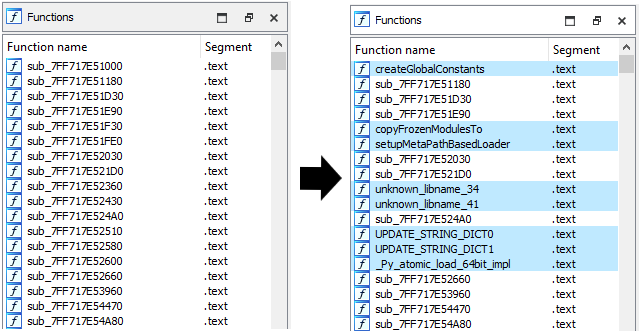
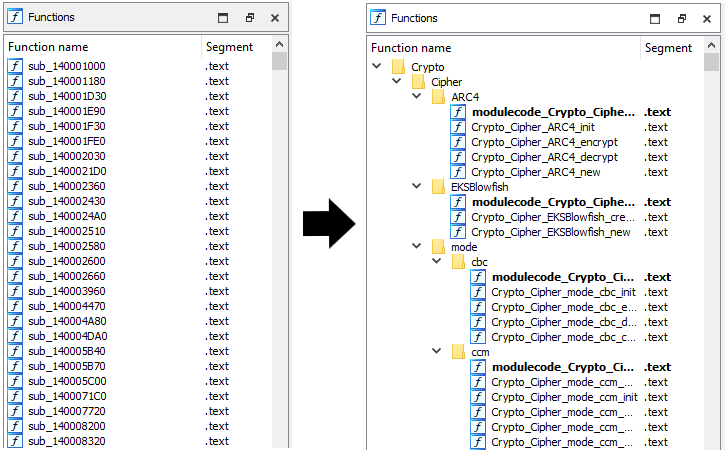
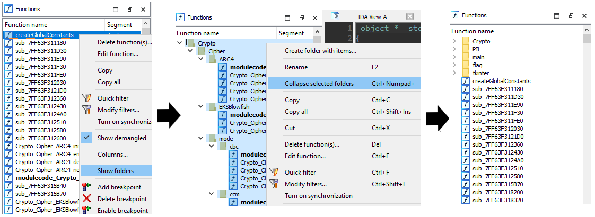
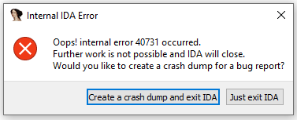

# nuitka-helper

nuitka-helper is a collection of IDAPython scripts to help analyze Nuitka binaries. It is **intended to be used in conjunction with its accompanying blog post [here](https://www.notion.so/goatmilkk/Nuitka-a3ac9ee7f3f240f3baa345c17f2b8aa3?pvs=4)**. If you have queries, the answers are probably in the blog.


# Main Features

### Library Code Recovery



### User Code Recovery



### Constants Recovery


# Setup

> See blog for detailed information

1. Unpack Nuitka binary
2. Create Nuitka header file
    - Optional since `nuitka.h` is provided, but some structs might become obsolete in the future
3. Create FLIRT signature
    - Optional but highly recommended as other heuristics may not be as reliable
      - Use `get_nuitka_version.py` to help

# Usage

> Some scripts use the debugger so run them in a VM if needed

1. Run `nuitka-helper.py` on unpacked binary

2. Organize functions by module
   
    
    
3. View logged constants in `constants.log`
   
    

# Plugins

- Parse additional constants using `parse_module_constants.py`
  - Particularly, we can use it to trace the module dictionary (while debugging)

    

- Hook functions using `hook_module_functions.py`
  
  - View function trace in `trace.log`
    
    
  
- Get function definitions by injecting `get_module_functions.py` into Python process

  - This can be done using a Python injector like [pynject](https://github.com/acureau/pynject)

    - Inject **after** target modules get imported for best results

  - View function definitions in `functions.log`
  
    

# Directory Structure

```jsx
├───files
    │   nuitka.h (Nuitka header file)
    │
    └───flake (output files for flake.exe)
            flake.sig
            solve.py
 
├───examples
    ├───types: (test cases for parse_module_constants.py)
    │       scalar
    │       collections
    │
    └───constructs: (code constructs that are harder to recognize)
            loops
            try-except
 
├───scripts
    ├───setup
    │       get_nuitka_version.py
    │
    ├───symbol recovery
    │       nuitka-helper.py
    │       recover_library_code.py
    │       recover_modules.py
    │       recover_constants.py
    │       recover_functions.py
    │
    └───plugins
            get_module_functions.py
            hook_module_functions.py
            parse_module_constants.py
```

# Supported Platforms

- Windows (not tested on other platforms)

# Known Issues

- Script crashes sometimes due to some Appcall/debugger bug (internal error 40731/unhandled c++ exception)

    

    - Temporary Fix:
        - Increase the sleep timer in `recover_constants.py`
        - Re-run `nuitka-helper.py`

# Future Work

> Work that never gets done

- `recover_constants.py`
  - Fix Appcall/debugger bug (not sure why but this occurs occasionally for certain samples)
- `recover_library_code.py`
  - Load structs as type library instead of header file
- `recover_module_constants.py`
  - Comment gets cut off if its too long
    - e.g. module dictionary -> gets printed as fallback for now
  - [IDA crashes if name is too long](https://hex-rays.com/products/ida/support/sdkdoc/name_8hpp.html)

# FAQ

The answers are in the blog for these questions:

- Q: How can I manually identify `Nuitka_Function_New`?
- Q: How do I identify the main module dictionary `moduledict___main__`?
- Q: Where do I find the code logic in the Nuitka module/function?

---

- Q: Why did you choose to parse the constants dynamically (instead of statically)?
  - A: First, doing so enables me to trace the module dictionary, which changes at different points of the program. Second, I want the parsing algorithm to be independent of how Nuitka loads its constants, in case it gets updated in the future.
- Q: What Nuitka versions does this tool support?
  - A: I only tested the tool on `flake` (1.8.0) & `GhostLocker` (1.8.4), but I think it should (somewhat) work for other versions too. I did not test the tool on any commercial Nuitka binaries.
- Q: What can I do if the tool breaks?
  - A: Here are some things you can try:
    1. Manually identify `modulecode__main__` using the `Loaded %s` string instead of `__main__`
    2. Manually identify important library functions (i.e. `loadConstantsBlob`, `Nuitka_Function_New`)
    3. `ida_typeinf.get_arg_addrs` might be broken (function typed wrongly/remote debugging buggy)
    4. Let the binary automatically load the constants instead of forcibly loading them